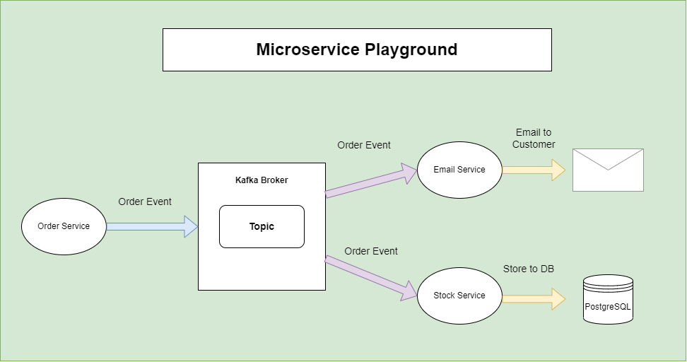

# springboot-kafka-microservices-playground
Sample project to learn microservices and playground. Its and ordering system

<h1>Event-Driven Microservice Architecture</h1>




<h1>Available Microservices</h1>

Click on the microservice link to go to Spring Initialzr

| Microservice                                                                                                                                                                                                                                                                                                                                      | Description                              | Tomcat Port           |
|---------------------------------------------------------------------------------------------------------------------------------------------------------------------------------------------------------------------------------------------------------------------------------------------------------------------------------------------------|------------------------------------------|-----------------------|
| [order-service](https://start.spring.io/#!type=maven-project&language=java&platformVersion=2.7.2&packaging=jar&jvmVersion=11&groupId=net.dzakirinmd&artifactId=order-service&name=order-service&description=Demo%20Microservice%20project%20for%20Spring%20Boot%20Order%20Service&packageName=net.dzakirinmd.orderservice&dependencies=web,kafka) | Order Producer Service to produce order  | http://localhost:8086 |
| [stock-service](https://start.spring.io/#!type=maven-project&language=java&platformVersion=2.7.2&packaging=jar&jvmVersion=11&groupId=net.dzakirinmd&artifactId=stock-service&name=stock-service&description=Demo%20Microservice%20project%20for%20Spring%20Boot%20Stock%20Service&packageName=net.dzakirinmd.stockservice&dependencies=web,kafka) | Stock Consumer Service to consumer order | http://localhost:8087 |
| [email-service](https://start.spring.io/#!type=maven-project&language=java&platformVersion=2.7.2&packaging=jar&jvmVersion=11&groupId=net.dzakirinmd&artifactId=email-service&name=email-service&description=Demo%20Microservice%20project%20for%20Spring%20Boot%20Stock%20Service&packageName=net.dzakirinmd.emailservice&dependencies=web,kafka) | Email Consumer Service to consume order  | http://localhost:8088 |
| [base-domain](https://start.spring.io/#!type=maven-project&language=java&platformVersion=2.7.2&packaging=jar&jvmVersion=11&groupId=net.dzakirinmd&artifactId=base-domains&name=base-domains&description=Demo%20Microservice%20project%20for%20Spring%20Boot%20Base%20Domains&packageName=net.dzakirinmd.basedomains&dependencies=lombok)          | To keep all domain entity                | N/A                   |

<h1>Project Dependency</h1>

| Project Dependency | Version |
|--------------------|---------|
| `Spring Boot`      | 2.7.2   |
| `Kafka`            | 3.2.1   |
<h1>Start Kafka Environment</h1>

1. open terminal to start Kafka Zookeeper:
2. cd /path/to/kafka_2.12-3.2.1
    1. For Window Powershell: ```.\bin\windows\zookeeper-server-start.bat .\config\zookeeper.properties```
    2. For Linux/Mac: ```bin/zookeeper-server-start.sh config/zookeeper.properties```
3. open new terminal to start Kafka server:
    1. For Window Powershell: ```.\bin\windows\kafka-server-start.bat .\config\server.properties```
    2. For Linux/Mac: ```bin/kafka-server-start.sh config/server.properties```
4. Kafka broker is running at localhost:9092
5. To delete Kafka Topic:
   1. for Linux/Mac: ```./bin/kafka-topics.sh --bootstrap-server localhost:9092 --delete --topic order-topics```
6. To read the message in topic:
   1. For Window Powershell: ```.\bin\windows\kafka-console-consumer.bat --topic order-topics --from-beginning --bootstrap-server localhost:9092```
   2. For Linux/Mac: ```bin/kafka-console-consumer.sh --topic order-topics --from-beginning --bootstrap-server localhost:9092```
   3. available topics:
      1. order-topics (Producer)